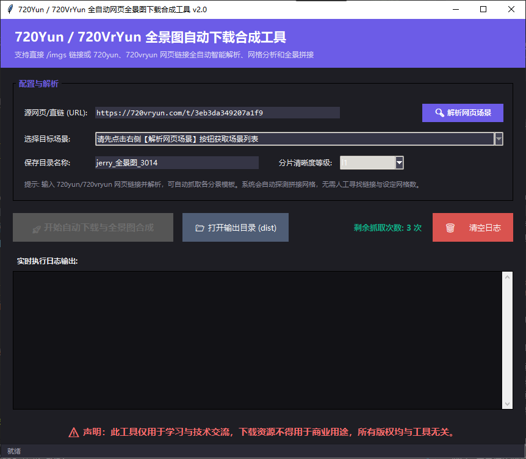
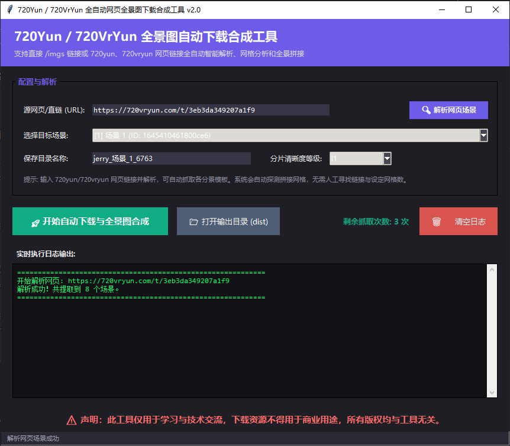
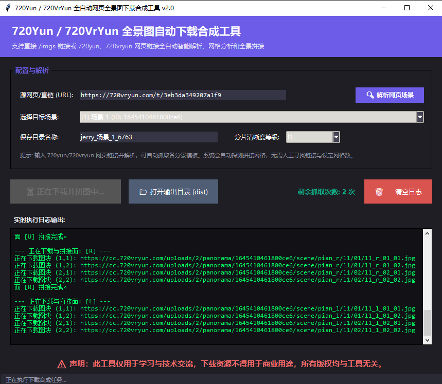

# 720Yun / 720VrYun 全自动全景图下载合成工具

这是一个基于 Python Tkinter 的可视化图形界面（GUI）工具，用于全自动解析 720Yun 和 720VrYun 网页链接、下载切片图块并缝合还原为高质量的 2:1 等距柱状全景图。

## 界面预览

### 1. 软件主界面


### 2. 场景自动解析


### 3. 下载与缝合进程


## 功能特性

1. **自动网页场景解析**：输入网页链接即可一键拉取作品下所有子场景，无需手动分析网络请求寻找直链前缀。
2. **多分辨率图块网格自适应探测**：系统自动探测当前选定清晰度（`l1` ~ `l4`）下的网格行数与列数（如 5x5、3x3 等），跳过复杂的行列参数配置。
3. **扁平化结构输出与临时文件清理**：最终大图直接输出至选定的保存文件夹根目录，任务完成后自动物理删除中途下载的几百个琐碎临时分片文件夹。
4. **防误触 UI 锁定**：【开始下载合成】按钮启动时默认置灰禁用，只有在网页场景解析成功后才被激活。一旦输入框 URL 文本发生改变，按钮将立刻二次置灰重新加锁。

---

## 运行环境

1. 安装依赖包：
   ```bash
   pip install -r requirements.txt
   ```
2. 运行 GUI 工具：
   ```bash
   python gui.py
   ```

---
## 下载地址

* **绿色免安装版下载**：您可以直接点击下方链接，下载编译好的独立 Windows 运行程序：
  * [👉 下载 全景下载合成工具.exe (位于本仓库 dist 目录)](dist/%E5%85%A8%E6%99%AF%E4%B8%8B%E8%BD%BD%E5%90%88%E6%88%90%E5%B7%A5%E5%85%B7.exe)
